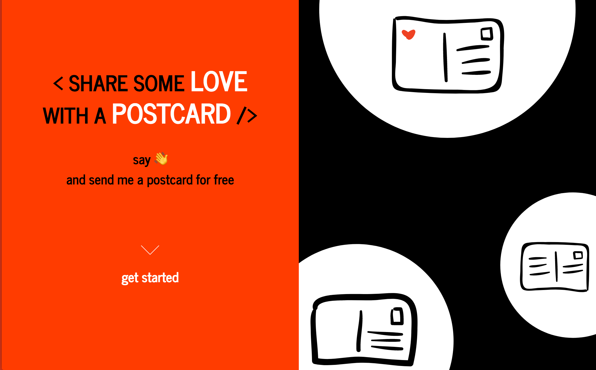

# postcard-love
> Say hi and send me a physical postcard for free

Browse https://postcard.abertschi.ch  

## Technology stack
- Frontend
  + html5, js, css
  + vue.js
  + webpack and gulp.js
- Backend
  + Python3+
  + Flask
  + nginx, gunicorn
- Database
  + sqllite3
  + pony orm

## About
Made during Xmas 2017 with 🥛, ☕️ and much ❤️ by Andrin Bertschi
- https://twitter.com/andrinbertschi
- www.abertschi.ch
